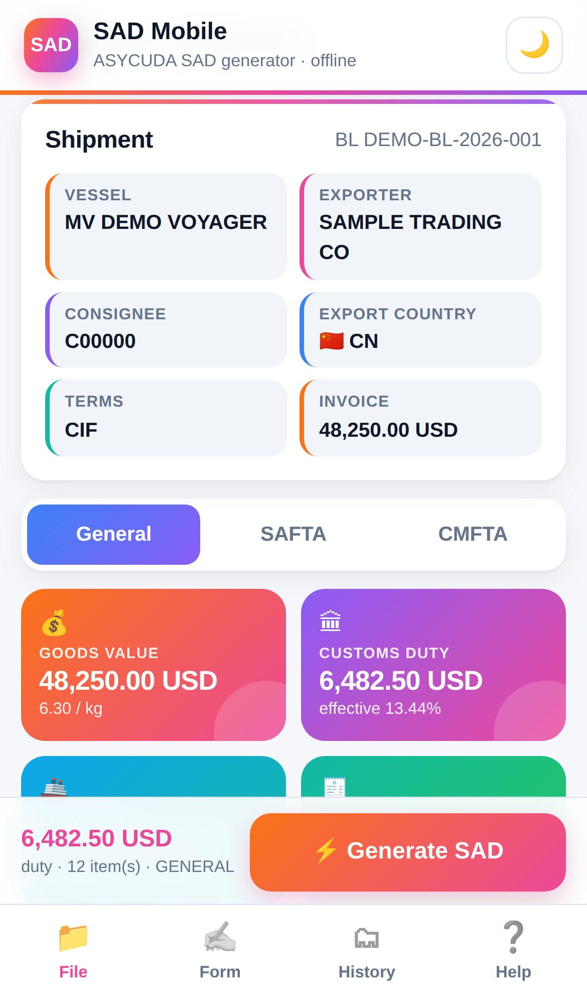
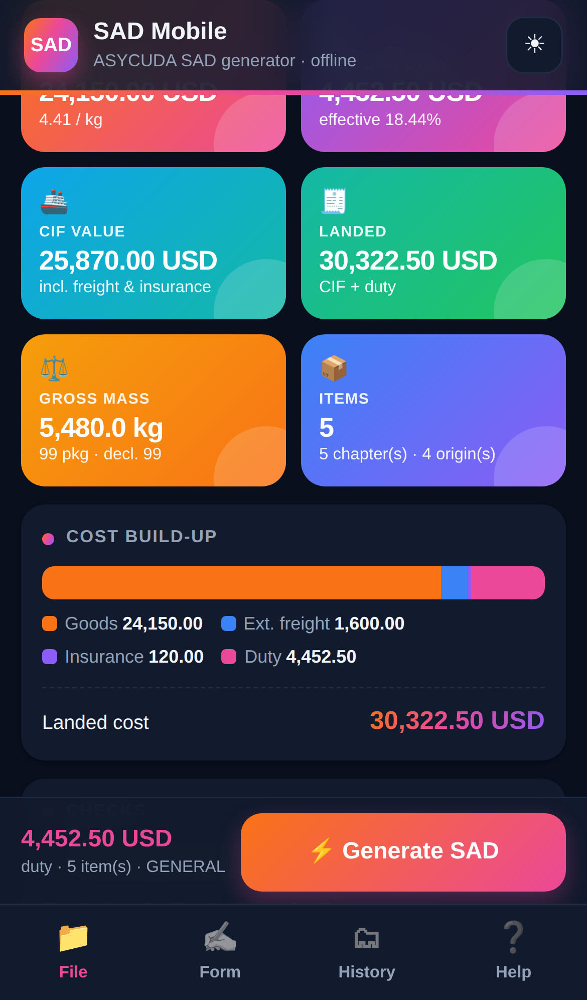
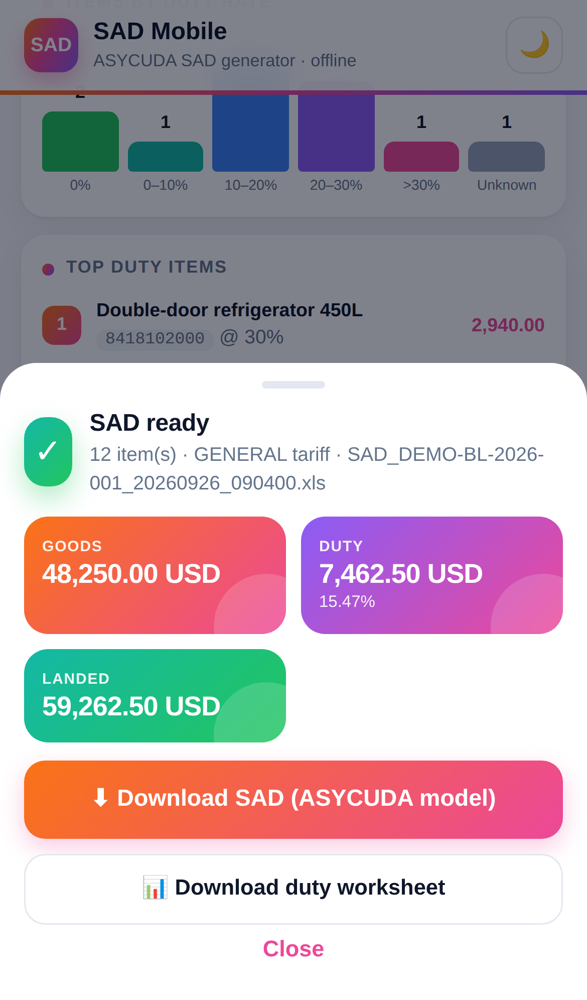
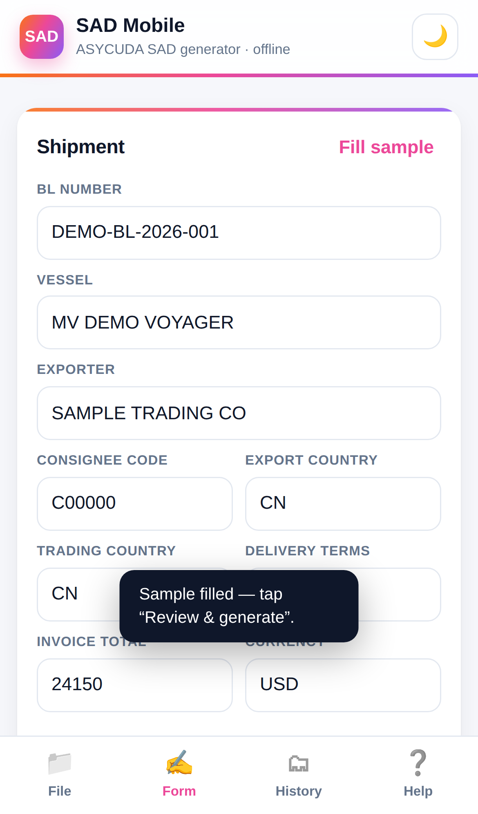

# SAD Mobile — ASYCUDA SAD generator for your phone

Generate **ASYCUDA SAD import files on a phone**, in the browser. **Scan the supplier's invoice**, or open a filled SAD model or template, check the figures, type any missing duty rates, and download the **official ASYCUDA SAD model filled in** — ready to import.

**Open it: <https://quantscript007.github.io/asycuda-sad-mobile/>**

- 📱 **Mobile web app** — no install needed; add it to the home screen to use it like an app.
- 📷 **Scan invoices** — photograph or pick invoices, packing lists and B/Ls; the lines are read into the form.
- 🔒 **Private** — files are read and created on the phone. Nothing is uploaded, unless you add an API key for Claude reading.
- ✈️ **Works offline** after the first visit.
- 📄 **Same output as the desktop app** — the SAD model keeps its dropdowns, field-hint comments, hidden currency columns and formatting.

**Open it:** `https://quantscript007.github.io/asycuda-sad-mobile/` (after GitHub Pages is switched on — see below).

<table>
<tr>
<td width="25%"></td>
<td width="25%"></td>
<td width="25%"></td>
<td width="25%"></td>
</tr>
</table>
<sub>Screenshots use made-up demo data.</sub>

## What it does

| Tab | |
|---|---|
| **📷 Scan** | Take photos or pick PDFs of the invoice (plus packing list / B/L). Free reading runs on the phone (OCR); with an Anthropic API key in *Reading settings*, Claude reads the pages, merges packing lists and suggests HS codes. The result opens in the Form with doubtful fields highlighted, and a 📄 Pages button to check against the documents. |
| **📁 File** | Open an `.xls` / `.xlsx` from the phone (Files, Drive, WhatsApp downloads…): the SAD model, the simple template, or a SAD made earlier. |
| **Review** | Shipment details, tariff switch (**General / SAFTA / CMFTA**), insights — goods, duty & effective rate, CIF, landed cost, mass, cost build-up, duty by HS chapter, value by origin, rate bands, top duty items, invoice / package checks — and every item with an editable duty rate and a 🔎 link to the Maldives Customs tariff search. |
| **⚡ Generate** | Download or **share** (WhatsApp, email, Drive…) the filled **SAD model** and the **duty worksheet**. |
| **✍️ Form** | Enter a shipment by hand. The form is saved on the phone as you type. |
| **🗂 History** | The last 30 generated SADs, kept on the phone — download, share or delete. |
| **❓ Help** | Blank SAD model, model with sample rows, simple template. |

### Duty and revenue in MVR

With the **MVR exchange rate** (Maldives Customs rate, [customs.gov.mv/eServices/exchangeRate](https://customs.gov.mv/eServices/exchangeRate)) each item gets:

| | Formula |
|---|---|
| **Duty (MVR)** | item price × duty % × MVR rate |
| **Revenue (MVR)** | item price × MVR rate × 0.01 |
| **Payable (MVR)** | duty + revenue |

The rate comes from an `exchange_rate` value in your file, the rate you last used for that currency, or 15.42 for USD — type today's rate in the box on the review screen (tap **Check ↗** to open the Customs page). A phone browser isn't allowed to read the Customs site directly, so the rate can't be fetched automatically here; the desktop app does fetch it. The duty worksheet gets *Exchange rate, Value, Duty, Revenue* and *Payable (MVR)* columns plus totals.

ASYCUDA field limits from the model are applied with a warning: description 49 characters, brand / model / size 24, packing codes 5.

### Duty rates

A browser can't query the customs website directly, so rates come from your file (e.g. a `duty_rate` column in the simple template, or a duty worksheet from the desktop app) or are typed on the review screen. Tap 🔎 on an item to look it up on the Maldives Customs tariff.

## Switching on GitHub Pages (one time)

1. Open the repository → **Settings → Pages**.
2. Under **Build and deployment → Source**, choose **GitHub Actions**.
3. The *Test & deploy to GitHub Pages* workflow publishes the site on every push to `main` (or run it from the **Actions** tab).

Then open `https://<your-user>.github.io/asycuda-sad-mobile/` on the phone. In Chrome use **⋮ → Add to Home screen**; in Safari **Share → Add to Home Screen**.

## Run it locally

Any static web server works (the app needs `http://`, not `file://`):

```bash
python3 -m http.server 8080
# open http://localhost:8080 — or http://<your-PC-IP>:8080 from a phone on the same Wi-Fi
```

## How it works

Plain HTML/CSS/JavaScript — no build step.

```
index.html            the app (4 tabs + result sheet)
css/app.css           mobile-first styles, light & dark
js/app.js             UI
js/scan.js            Scan tab: PDF pages (pdf.js), OCR (Tesseract.js) or Claude, loaded on first use
js/invoice-parse.js   invoice text / Claude reply → SAD fields, with checks (port of the desktop invoice_scan.py)
js/sad-core.js        read workbooks, duty, analytics, fill the SAD model, duty worksheet
js/xls-template.js    edits .xls cells in place so dropdowns & comments survive
js/store.js           history (IndexedDB) and form draft (localStorage)
templates/SAD_MODEL.xls   the ASYCUDA SAD model
vendor/xlsx.full.min.js   SheetJS 0.18.5 (Apache-2.0) for reading Excel files
sw.js, manifest.webmanifest   offline support / install
```

`sad-core.js` and `xls-template.js` are JavaScript ports of the desktop app's Python modules and produce the same results (checked against it in development).

To use an updated SAD model, replace `templates/SAD_MODEL.xls` and bump `CACHE` in `sw.js`.

## Tests

```bash
npm ci
npm test
```

The tests fill the SAD model, check that dropdown, comment, drawing, merge and column records are unchanged, read the result back, and verify duty, analytics and the duty worksheet.

## Notes

- SheetJS 0.18.5 is the last version on npm. It is only used to read files you choose yourself on your own device.
- Always check HS codes and duty before lodging a declaration.
